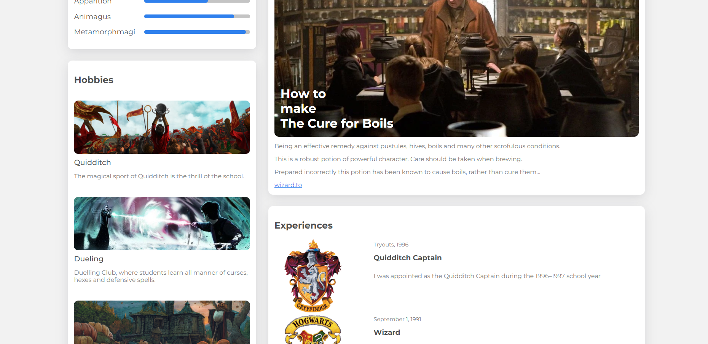

# Harry Potter portfolio

This is a small responsive portfolio made for our great wizard Harry Potter.

## Table of contents

- [Harry Potter portfolio](#harry-potter-portfolio)
  - [Table of contents](#table-of-contents)
  - [Overview](#overview)
    - [Screenshot](#screenshot)
    - [Links](#links)
  - [My process](#my-process)
    - [Built with](#built-with)
  - [Author](#author)

## Overview

### Screenshot

### Links

- Live Site URL: [Live site URL](https://harry-potter-portfolio-two.vercel.app/)

## My process

### Built with

- Semantic HTML5 markup
- CSS
- Flexbox
- Grid
- JS

## Author

- LinkedIn - [Ismail Kemmoune](https://www.linkedin.com/in/ismail-kemmoune/)
- Frontend Mentor - [@IsmailKemmoune](https://www.frontendmentor.io/profile/IsmailKemmoune)
- Twitter - [@IsmailKemmoune](https://twitter.com/IsmailKemmoune)
